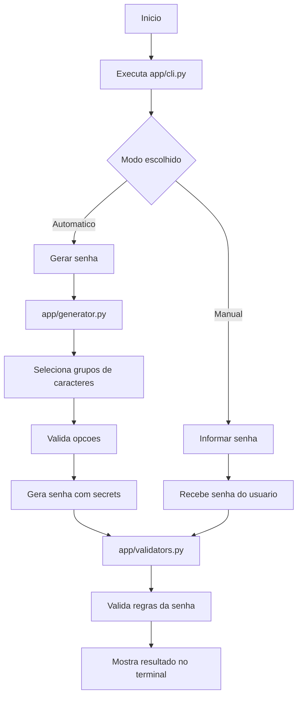
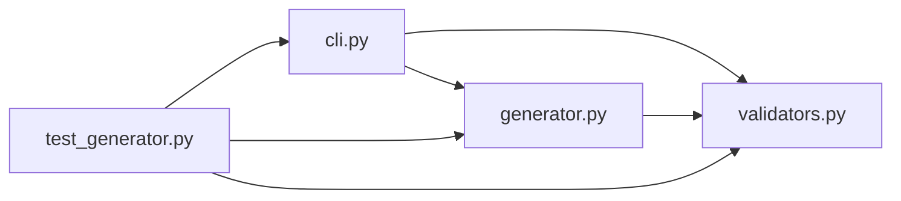

## Password Generator CLI

Projeto Python de linha de comando para gerar e validar senhas seguras.

### Funcionalidades

- Geracao criptograficamente segura com `secrets`
- Escolha de letras maiusculas, minusculas, numeros e simbolos
- Garantia de pelo menos um caractere de cada grupo selecionado
- Modo automatico ou manual na CLI
- Validacao final da senha gerada ou informada
- Testes automatizados com `pytest`

### Requisitos

- Python 3.10+

### Instalacao

```powershell
python -m pip install -r requirements.txt
```

### Como executar

```powershell
python -m app.cli
```

A aplicacao pergunta no inicio se voce quer:

- gerar uma senha automaticamente
- informar uma senha manualmente

### Exemplos

Geracao automatica:

```powershell
python -m app.cli --mode automatic --length 12 --uppercase --lowercase --numbers --symbols
```

Senha manual:

```powershell
python -m app.cli --mode manual --password MinhaSenha123! --uppercase --lowercase --numbers --symbols
```

### Diagrama

Fluxo principal da aplicacao:



Estrutura dos modulos:



### Testes

```powershell
python -m pytest -q
```
