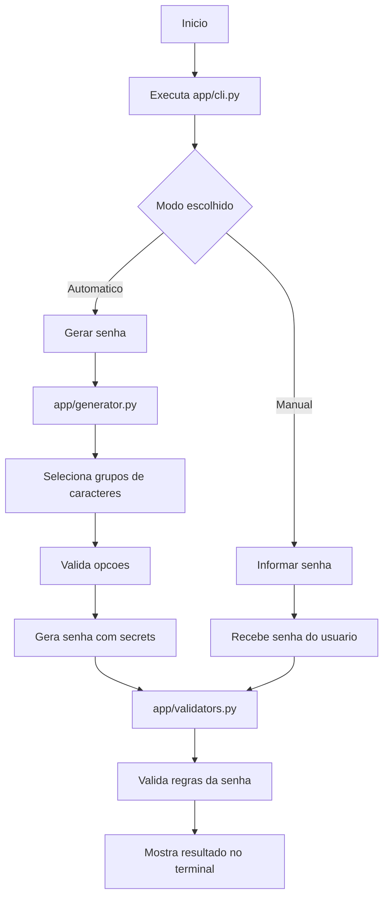
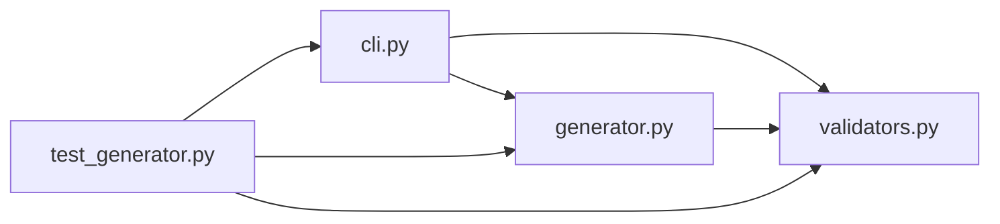

## Password Generator CLI

Projeto Python de linha de comando para gerar e validar senhas seguras.

### O que o projeto resolve?

Este projeto resolve a necessidade de criar senhas mais seguras de forma simples, rapida e padronizada em linha de comando.

Com ele, o usuario pode:

- gerar senhas automaticamente com seguranca criptografica
- escolher quais tipos de caracteres deseja usar
- garantir que a senha tenha pelo menos um caractere de cada grupo selecionado
- informar uma senha manualmente e validar se ela atende aos criterios definidos

### Funcionalidades

- Geracao criptograficamente segura com `secrets`
- Escolha de letras maiusculas, minusculas, numeros e simbolos
- Garantia de pelo menos um caractere de cada grupo selecionado
- Modo automatico ou manual na CLI
- Validacao final da senha gerada ou informada
- Testes automatizados com `pytest`

### Requisitos

- Python 3.10+

### Como instalar?

```powershell
python -m pip install -r requirements.txt
```

### Como executar?

```powershell
python -m app.cli
```

A aplicacao pergunta no inicio se voce quer:

- gerar uma senha automaticamente
- informar uma senha manualmente

### Exemplos

Geracao automatica:

```powershell
python -m app.cli --mode automatic --length 12 --uppercase --lowercase --numbers --symbols
```

Senha manual:

```powershell
python -m app.cli --mode manual --password MinhaSenha123! --uppercase --lowercase --numbers --symbols
```

### Como rodar os testes?

```powershell
python -m pytest -q
```

Os testes verificam:

- tamanho correto da senha
- presenca dos caracteres obrigatorios
- diferenca entre senhas geradas em execucoes distintas
- validacao de regras e cenarios de erro

### Quais limites existem?

- A aplicacao funciona apenas em linha de comando, sem interface grafica.
- A validacao verifica os tipos de caracteres exigidos, mas nao mede nivel de forca avancado da senha.
- O projeto depende do Python instalado na maquina.
- O foco atual esta em uso local e educacional, nao em integracao com banco de dados, API ou interface web.
- Alguns textos da CLI ainda podem ser refinados para manter o idioma totalmente consistente.

### Como a IA foi usada no processo?

A IA foi usada como apoio no desenvolvimento do projeto, ajudando em tarefas como:

- estruturacao do codigo
- criacao e ajuste das funcoes de geracao e validacao
- criacao da interface de linha de comando
- escrita e revisao dos testes automatizados
- documentacao do projeto no `README.md`

O codigo foi revisado, ajustado e executado no ambiente do projeto durante o processo.

### Diagrama

Fluxo principal da aplicacao:



Estrutura dos modulos:


